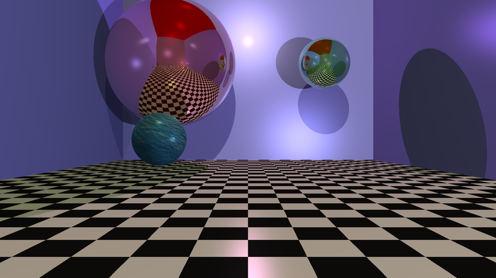
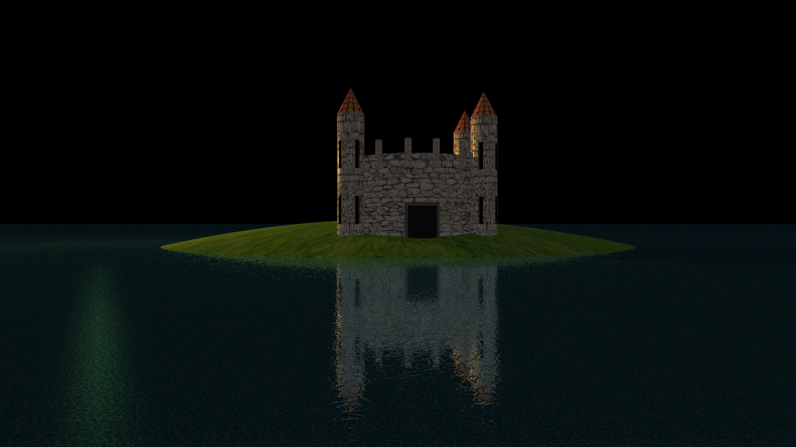
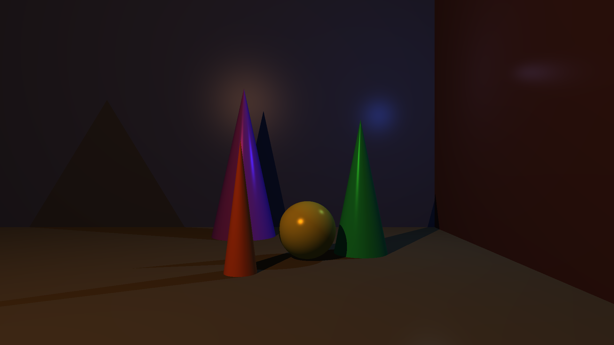
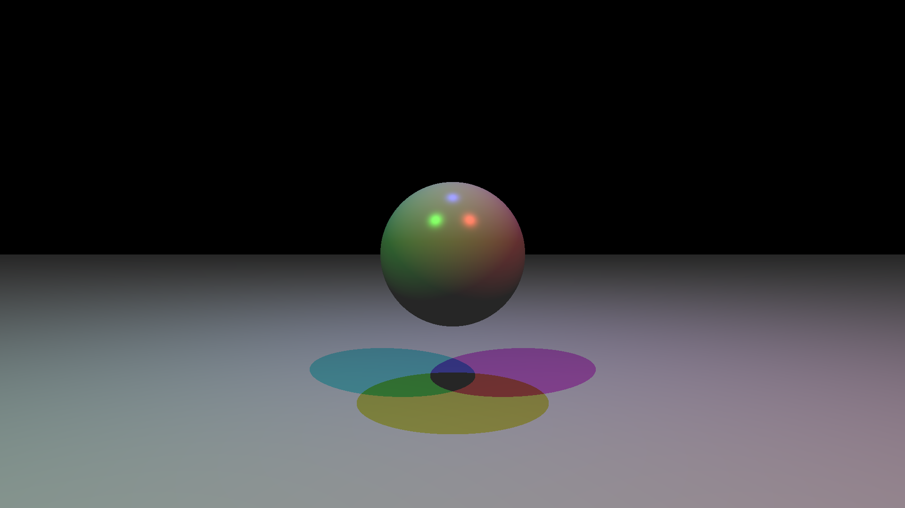
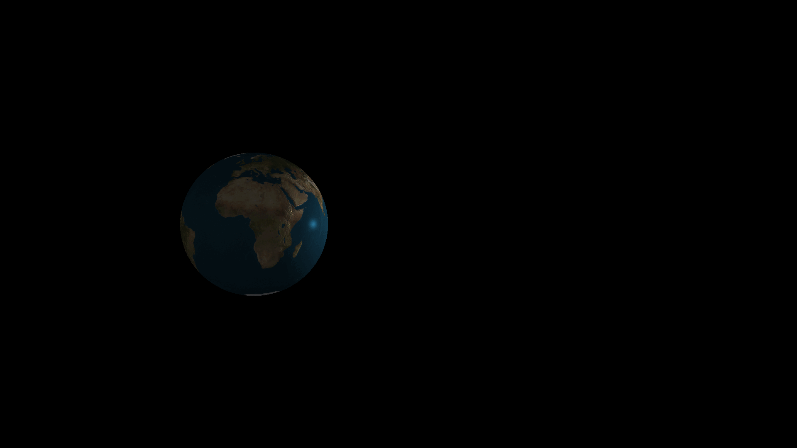

# miniRT

> A ray tracer written from scratch in C — Blinn-Phong shading, UV texture mapping, bump mapping, and interactive real-time controls.

<!-- Replace the lines below with actual screenshots once rendered -->
<!-- Tip: run ./miniRT assets/scene/spheres.rt and take a screenshot -->



---

## Features

| Feature | Detail |
|---|---|
| **Primitives** | Sphere, plane, cylinder, cone |
| **Lighting** | Blinn-Phong (diffuse + specular), multiple light sources, ambient |
| **Textures** | XPM texture mapping with UV projection per primitive |
| **Bump mapping** | Normal perturbation from XPM bump maps |
| **Interactive mode** | Move / rotate camera and objects with keyboard in real time |
| **Fast math** | Double-precision Quake fast inverse square root for vector normalization |
| **Scene format** | Human-readable `.rt` scene files |

---

## Installation

### Requirements

- Linux (X11)
- `gcc`, `make`
- `libXext`, `libbsd`

```bash
# Ubuntu / Debian
sudo apt install gcc make libxext-dev libbsd-dev
```

### Build

```bash
git clone https://github.com/Ayoubkrif/miniRT.git
cd miniRT
make
```

### Run

```bash
./miniRT assets/scene/spheres.rt
```

---

## Docker

A Docker image is provided to simplify compilation without setting up the build environment manually.

```bash
make docker-build           # build the image once
make docker-make            # compile inside the container
```

---

## Scene file format

### Mandatory elements

```
# Ambient light      ratio   R,G,B
A  0.2               255,255,255

# Camera             position        direction       FOV
C  0,0,-5            0,0,1           70

# Light              position        brightness      R,G,B
L  -40,50,0          0.9             255,255,255
```

### Primitives

Base parameters only (no extras required):

```
# Sphere             center          diameter        R,G,B
sp 0,0,3             2               255,0,0

# Plane              point           normal          R,G,B
pl 0,-1,0            0,1,0           100,200,100

# Cylinder           center          axis      diameter  height  R,G,B
cy 0,0,3             0,1,0           1         3         0,0,255

# Cone               apex            axis      diameter  height  R,G,B
co 0,3,3             0,-1,0          2         2         255,165,0
```

### Optional modifiers (append after base parameters)

| Modifier | Description | Example |
|---|---|---|
| `t:path` | XPM texture map | `t:texture/earth.xpm` |
| `b:path` | XPM bump map | `b:bump/water_bump.xpm` |
| `r:float` | Reflectivity [0–1] | `r:0.7` |

Modifiers can be combined in any order:

```
sp 0,0,3   2      255,0,0    t:texture/earth.xpm  b:bump/earth.xpm  r:0.5
pl 0,-1,0  0,1,0  0,0,255    r:0.7  t:texture/water.xpm  b:bump/water.xpm
cy 0,0,3   0,1,0  1  3       0,0,255   t:texture/mur.xpm  r:0.3
co 0,3,3   0,-1,0 2  2       255,165,0  t:texture/tuile.xpm
```

### Material directive (Blinn-Phong coefficients)

The `M` directive sets the four Blinn-Phong shading coefficients for the entire scene.
It overrides the compile-time defaults and applies globally to all objects.

```
#              ka    kd    ks    alpha_s
M              0.3   0.5   0.9   200
```

| Field | Role | Default |
|---|---|---|
| `ka` | Ambient weight — scales how much of the scene ambient light each surface receives | `0.3` |
| `kd` | Diffuse weight — scales the Lambertian component per light source | `0.5` |
| `ks` | Specular weight — scales the intensity of the specular highlight | `0.9` |
| `alpha_s` | Shininess exponent — controls the spread of the specular lobe (higher = tighter, brighter highlight) | `200` |

`M` is optional. If absent, the compile-time values from `define.h` are used unchanged.
Place it after `root` (if present) and before the scene objects.

See `assets/scene/` for full examples.

---

## Controls

| Key | Action |
|---|---|
| `W` / `S` | Move camera forward / backward |
| `A` / `D` | Move camera left / right |
| `↑` / `↓` | Rotate camera up / down |
| `←` / `→` | Rotate camera left / right |
| `Tab` / `N` | Cycle through objects |
| `IJKL` | Move selected object |
| Mouse wheel | Move object along its axis |
| `KP 8` / `KP 2` | Shift texture / bump map up / down |
| `KP 6` / `KP 4` | Shift texture / bump map right / left |
| `P` | Save screenshot (`screenshot_NNN.ppm`) |
| `ESC` | Exit |

---

## Architecture

```
srcs/
├── main.c                  entry point, mlx event loop
├── init/                   scene parser, object constructors
├── intersection/           ray–object intersection, Blinn-Phong
├── math/                   vector ops, fast inverse square root
├── bump_texture/           UV mapping, bump normal computation
├── keyhook/                keyboard controls per object type
├── mlx/                    pixel write, window management
├── print/                  real-time HUD (object coordinates)
└── utils/                  color ops, camera basis
```

---

## Gallery

<p>
  
  
</p>
<p>
  
  
</p>



---

## References

- [Intersection of a Line and a Cone](https://www.geometrictools.com/Documentation/IntersectionLineCone.pdf) — Geometric Tools
- [Line–cylinder intersection](https://en.wikipedia.org/wiki/Line-cylinder_intersection) — Wikipedia
- [Blinn–Phong reflection model](https://en.wikipedia.org/wiki/Blinn%E2%80%93Phong_reflection_model) — Wikipedia
- [UV coordinates for sphere cylindrical projection](https://gamedev.stackexchange.com/questions/114412/how-to-get-uv-coordinates-for-sphere-cylindrical-projection) — Game Dev Stack Exchange
- [UV mapping](https://en.wikipedia.org/wiki/UV_mapping) — Wikipedia

---

## Authors

- [Ayoub](https://github.com/Ayoubkrif)
- [Clara](https://github.com/Bordeau-Clara)
